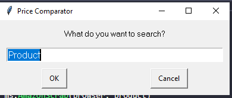
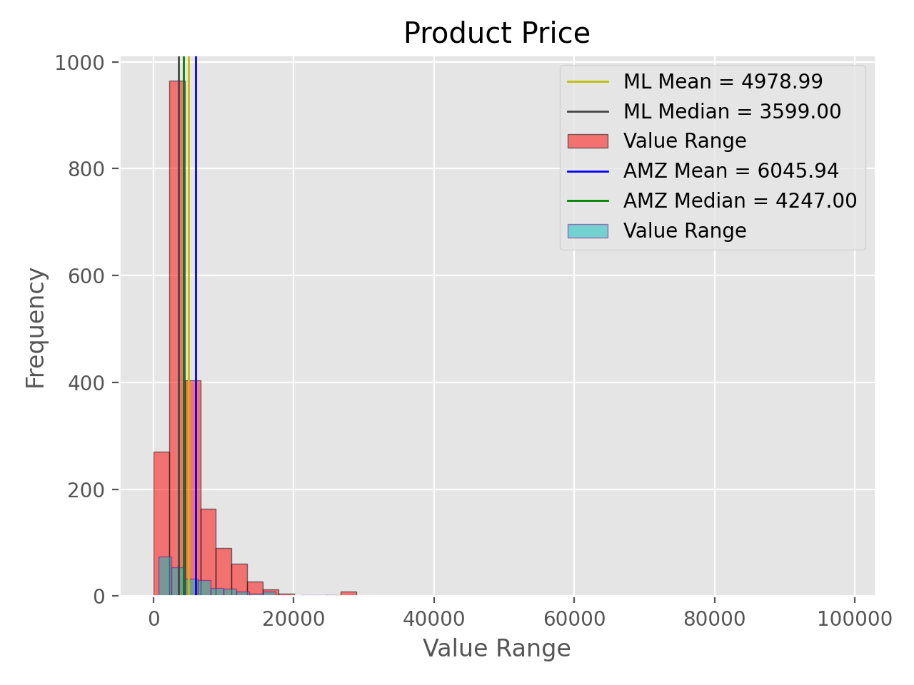
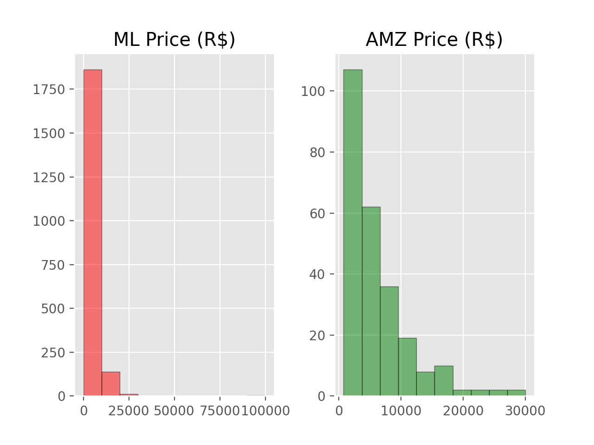
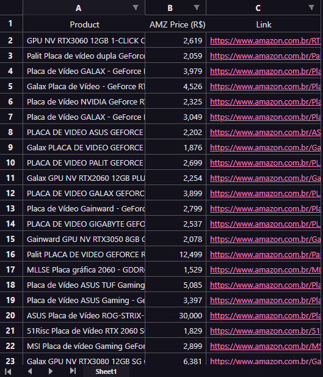
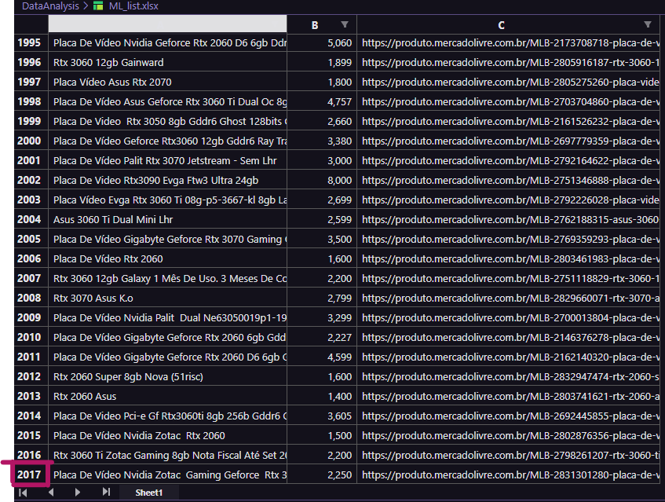

# Price Comparator using Web Scraping with Python

## Getting Started
- First you'll need to install python modules:
  ~~~Shell
  pip install selenium
  pip install bs4
  pip install pyautogui
  pip install  webdrivermanager
  pip install matplotlib
  pip install pandas
  ~~~

- Then, clone the repository:
  ~~~Shell
  git clone https://github.com/GabrielZuany/PriceComparator.git
  ~~~
   
  
  - After run the code, the only thing you need to do is insert the product name and click 'OK'   
  
    

## The reason behind the project:
 Automate the search, table and manipulate several information from different databases with specific structure.
 In this case, the database was a lot of commercial websites in witch each of them have their own builded HTML and CSS differently to the others.
 This project came when a realize the time and effort to collect all information manually, not easy and inefficient by the time overview. So, the idea was automate
 this process.
 
## How it works?
  Basically it works by automating the internet browsing using:
  1. **Selenium** and **Webdriver** to open browser and click or submit.
  2. **BeautifulSoup** to get html page, after establish a stable connection (Response ~200).
  3. **Pandas** and **Matplotlib** to analyze and build plot with the collected data.
  
  When the connection is stable, the script pulls the HTML page content. Once I have the HTML, I can look for elements that I'm interested to collect about the
  current page and store it into a _list_. 
  Using _**Selenium**_ to go through the websites pages, and _**bs4**_ to extract all data that I want to, the automating system is almost
  100% concluded. 
  When my product list is finished, I start to build plots (histograms) -_**Matplotlib**_- to analyse the collected data. 
  Then, I read the price column into dataframe (_**Pandas**_) and start to manipulate it to obtain important values like mean, median and (future) other info.  
  At the end, I will have .xlsx files with all product information (Name, price, link...) and two statistical graph to interpret the data. 
  
## Histograms:
    
  
  
    
  
## XLSX files:
  
  
  
    
  
## Last Updates:
  - Displays a window asking the user to enter the product name they want to search.

## Additional Information:
  - Author: Gabriel Zuany Duarte Vargas. (ES, Brazil) 
  - Date: 18/11/2022 (_last update_) 
  - **Please, feel free to suggest improvements and new features!** 
  - You can contact me in _gzuanydev@gmail.com_. 
